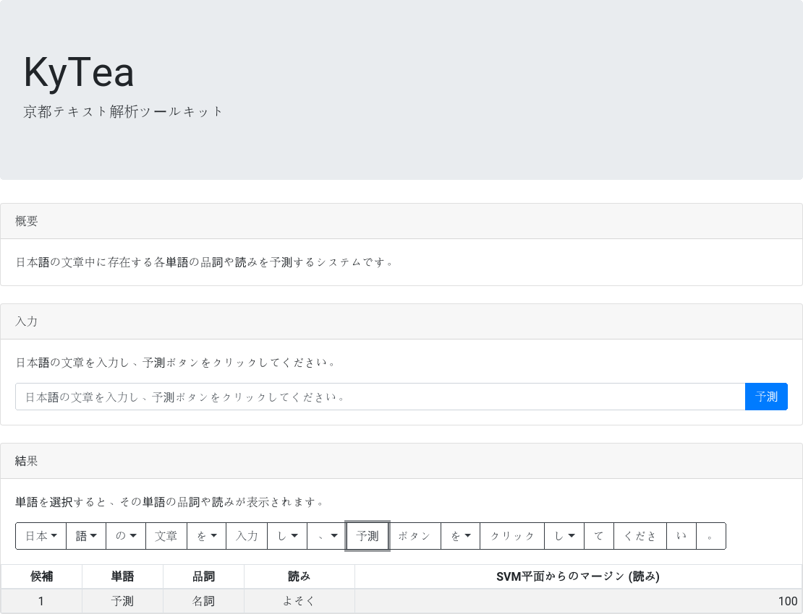

# KyTeaデモプログラム (非公式)
[](LICENSE)
[](https://codeclimate.com/github/massongit/kytea-demo/maintainability)  
[KyTea](http://www.phontron.com/kytea/index-ja.html)によって予測された品詞や読みを分かりやすく表示するデモプログラム (非公式)

## 作者
Masaya Suzuki <suzukimasaya428@gmail.com>

## バージョン
0.1.5

## 開発言語・主要ライブラリ
### サーバーサイド
* [Python](https://www.python.org/) 3.x
* [Mykytea-python](https://chezou.hatenablog.com/entry/20110715/1310699249)
* [Flask](http://flask.pocoo.org/)
* [uWSGI](https://uwsgi-docs.readthedocs.io/en/latest/)

### フロントエンド
* [Node.js](https://nodejs.org/ja/) 8.x
* [node-fetch](https://github.com/bitinn/node-fetch)
* [React](https://reactjs.org/)
* [Redux](https://redux.js.org/)
* [react-redux](https://redux.js.org/basics/usage-with-react)
* [Bootstrap](https://getbootstrap.com/)

## 対応ブラウザ
[browserl.ist: A page to display compatible browsers from a browserslist string.](https://browserl.ist/?q=>+0.2%25%2C+>+0.2%25+in+JP%2C+last+2+versions%2C+Firefox+ESR%2C+not+dead%2C+not+ie+<%3D+11%2C+not+OperaMini+all)参照

## 必要なソフトウェア
### 共通
* [KyTea](http://www.phontron.com/kytea/index-ja.html)
* [Python](https://www.python.org/) 3.x
* [pipenv](https://docs.pipenv.org/) (インストールコマンド: `pip install pipenv`)
* [nginx](http://nginx.org/) (nginxを使う場合のみ)
* [Apache2](https://httpd.apache.org/) (Apache2を使う場合のみ)

### `front/build`ディレクトリがない場合のみ
* [Node.js](https://nodejs.org/ja/) 8.x
* [Yarn](https://yarnpkg.com/ja/)

## 環境構築方法
### nginxやApache2を使う場合のみ
1. 以下のように`/etc/systemd/system/kytea-demo.service`を作成します。  
※`TODO`部の指示通りに書き換えを行ってください。

    ```/etc/systemd/system/kytea-demo.service
    [Unit]
    Description=uWSGI instance to serve kytea-demo
    After=network.target
    
    [Service]
    # TODO: 以下を記述し、コメントアウトを解除
    # User={実行時のユーザー}
    # Group={実行時のグループ}
    # WorkingDirectory={このディレクトリのパス}/server/src
    ExecStart=/usr/local/bin/pipenv run uwsgi --ini ../configs/uwsgi.ini
    
    [Install]
    WantedBy=multi-user.target
    
    ```

### nginxを使う場合のみ
1. 以下のように`/etc/nginx/sites-available/{ドメイン名}`を作成します。  
※`TODO`部の指示通りに書き換えを行ってください。

    ```/etc/nginx/sites-available/{ドメイン名}
    server {
        # TODO: 以下を記述し、コメントアウトを解除
        # server_name {ドメイン名};
        listen 80;
        
        # TODO: 以下を記述し、コメントアウトを解除
        # location ~ ^/{サブドメイン名}(/.*)?$ {
            include uwsgi_params;
            uwsgi_pass unix:/tmp/kytea-demo.sock;
            uwsgi_param PATH_INFO $1;
        }
    }
    
    ```

1. `sudo ln -s /etc/nginx/sites-available/{ドメイン名} /etc/nginx/sites-enabled/{ドメイン名}`コマンドを実行し、設定を有効化します。

### Apache2を使う場合のみ
1. `sudo apt install libapache2-mod-proxy-uwsgi`コマンドを実行し、`mod_proxy_uwsgi`をインストールします。
1. `sudo a2enmod rewrite`コマンドを実行し、`mod_rewrite`を有効化します。
1. 以下のように`/etc/apache2/sites-available/{ドメイン名}.conf`を作成します。  
※`TODO`部の指示通りに書き換えを行ってください。

    ```/etc/apache2/sites-available/{ドメイン名}.conf
    # TODO: 以下を記述し、コメントアウトを解除
    # <VirtualHost {ドメイン名}:80>
    	# TODO: 以下を記述し、コメントアウトを解除
    	# <Location /{サブドメイン名}>
    		ProxyPass unix:/tmp/kytea-demo.sock|uwsgi://kytea-demo
    		RewriteEngine on
    		# TODO: 以下を記述し、コメントアウトを解除
    		# RewriteRule ^/{サブドメイン名}(/.*)?$ $1
    	</Location>
    	
    	ErrorLog ${APACHE_LOG_DIR}/error.log
    	CustomLog ${APACHE_LOG_DIR}/access.log combined
    </VirtualHost>
    
    ```

1. `sudo a2ensite {ドメイン名}`コマンドを実行し、設定を有効化します。

### `front/build`ディレクトリがない場合のみ
1. 端末を起動します。
1. `cd {このディレクトリ}/front`コマンドを実行します。
1. `yarn install`コマンドを実行します。
1. `yarn build`コマンドを実行します。
1. `cd ..`コマンドを実行します。

### 共通
1. 端末を起動します。
1. `cd {このディレクトリ}/server/src`コマンドを実行します。
1. `pipenv install`コマンドを実行します。

## 実行方法
### Pythonを直接起動する場合
1. 端末を起動します。
1. `cd {このディレクトリ}/server/src`コマンドを実行します。
1. `pipenv shell`コマンドを実行します。
1. `python server.py`コマンドを実行します。
1. ブラウザから[http://localhost:5000/](http://localhost:5000/)にアクセスします。

### nginxを使う場合
1. `sudo systemctl start nginx kytea-demo`コマンドを実行します。
1. ブラウザからアクセスします。

### Apache2を使う場合
1. `sudo systemctl start apache2 kytea-demo`コマンドを実行します。
1. ブラウザからアクセスします。

## スクリーンショット


## ディレクトリ構造
* front/: フロントエンドのプログラムが格納されている
    * build/: ビルドした内容物が格納されている
    * public/: 静的なファイルが格納されている
        * index.html: フロントエンドのHTML
    * src/: ソースが格納されている
        * \_\_tests\_\_/: テストが格納されている
            * actions/: [Redux](https://redux.js.org/)のActionCreatorのテストが格納されている
                * index.js: ActionCreatorのテスト
            * components/: [React](https://reactjs.org/)のComponentのテストが格納されている
                * Header.js: ヘッダーのテスト
            * containers/: [react-redux](https://redux.js.org/basics/usage-with-react)のContainerのテストが格納されている
                * \_\_snapshots\_\_/: スナップショットテストで用いるデータが格納されている
                * App.js: ルート要素のContainerのテスト
                * Information.js: 解析結果表示部のContainerのテスト
                * InputSentence.js: 入力部のContainerのテスト
                * OutputCard.js: 解析結果表示部のパネルのContainerのテスト
                * PanelCardBody.js: CardのBodyのContainerのテスト
                * Sentence.js: 入力文をボタンのグループとして表示するComponentのContainerのテスト
                * Word.js: Sentenceの各ボタンのContainerのテスト
            * reducers/: [Redux](https://redux.js.org/)のReducerのテストが格納されている
                * index.js: ルートReducerのテスト
                * loading.js: ローディングActionのテスト
                * showSentence.js: [KyTea](http://www.phontron.com/kytea/index-ja.html)による解析結果の表示ActionのReducerのテスト
                * showPOSAndPronunciation.js: 品詞や読みの表示ActionのReducerのテスト
        * actions/: [Redux](https://redux.js.org/)のActionCreatorが格納されている
            * index.js: ActionCreator
            * type.js: Actionのタイプ
        * components/: [React](https://reactjs.org/)のComponentが格納されている
            * App.js: ルート要素
            * DescriptionCard.js: 概要パネル
            * Header.js: ヘッダー
            * Information.js: 解析結果表示部
            * InputSentence.js: 入力部
            * InputCard.js: 入力部のパネル
            * OutputCard.js: 解析結果表示部のパネル
            * PanelCardBody.js: CardのBody
            * Sentence.js: 入力文をボタンのグループとして表示するComponent
            * Word.js: Sentenceの各ボタン
        * containers/: [react-redux](https://redux.js.org/basics/usage-with-react)のContainerが格納されている
            * App.js: ルート要素のContainer
            * Information.js: 解析結果表示部のContainer
            * InputSentence.js: 入力部のContainer
            * OutputCard: 解析結果表示部のパネルのContainer
            * PanelCardBody.js: CardのBodyのContainer
            * Sentence.js: 入力文をボタンのグループとして表示するComponentのContainer
            * Word.js: Sentenceの各ボタンのContainer
        * reducers/: [Redux](https://redux.js.org/)のReducerが格納されている
            * index.js: ルートReducer
            * loading.js: ローディングActionのReducer
            * showSentence.js: [KyTea](http://www.phontron.com/kytea/index-ja.html)による解析結果の表示ActionのReducer
            * showPOSAndPronunciation.js: 品詞や読みの表示ActionのReducer
        * test_data/: テストで使用するデータが格納されている
        * translations/: メッセージリソースが格納されている
            * en.json: 英語のメッセージリソース
            * ja.json: 日本語のメッセージリソース
        * index.js: ルートとなるスクリプト
        * intl.js: メッセージリソース関連のスクリプト
        * setupTests.js: テストの際のセットアップ用スクリプト
    * .gitignore: Gitの管理から除外するファイル一覧
    * package.json: [Node.js](https://nodejs.org/ja/)の設定
    * yarn.lock: [Node.js](https://nodejs.org/ja/)のパッケージ情報 ([Yarn](https://yarnpkg.com/ja/)が使用)
* server/: サーバーサイドのプログラムが格納されている
    * configs/: 設定が格納されている
        * general.ini: 一般設定
        * uwsgi.ini: uWSGIを使用する場合の設定
    * logs: ログが格納されている
    * src/: ソースが格納されている
        * config.py: 設定ファイルを扱うためのオブジェクト
        * Pipfile: Pythonのパッケージ情報 ([pipenv](https://docs.pipenv.org/)が使用)
        * Pipfile.lock: Pythonのパッケージ情報 ([pipenv](https://docs.pipenv.org/)が使用)
        * server.py: サーバー
        * test_server.py: テスト用スクリプト
    * tests/: テストで用いるJSONファイルが格納されている
    * .gitignore: Gitの管理から除外するファイル一覧
* .gitignore: Gitの管理から除外するファイル一覧
* LICENSE: ライセンス
* README.md: README (MarkDown形式)
* README_develop.md: 開発者向けREADME (MarkDown形式)
* screenshot.png: スクリーンショット
